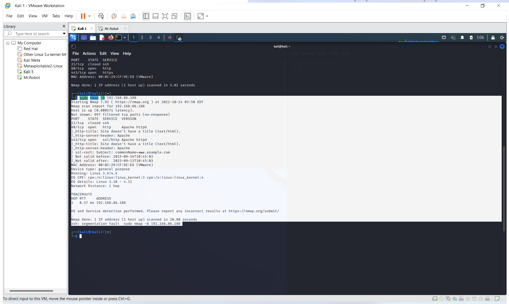

<h1>
IST4910
</h1>
<h2>Info Gathering</h2>
<em><b>Running an Nmap scan on Mr.Robot ip address</b></em>

    
    <ul>
        <li>Running Linux 3.10-4.11</li> 
        <li>Port 22  (SSH   : Closed)</li>
        <li>Port 80  (HTTP  : Open)</li>
            <ul>
                <li>Uses Apache</li>
            </ul>
        <li>Port 443 (HTTPS : Open)</li>
            <ul>
                <li>SSL cert is valid</li>
            </ul>
                <ul>
                    <li>Expires: 2025-09-13T10:45:03</li>
                </ul>
    </ul>
  

 
