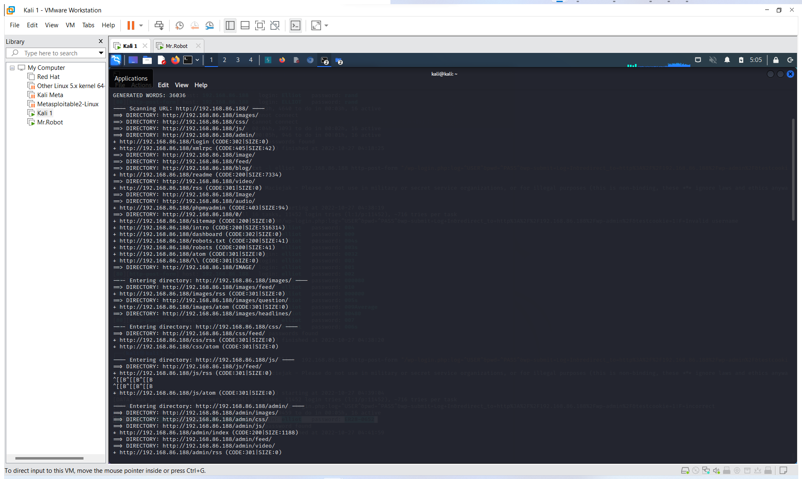
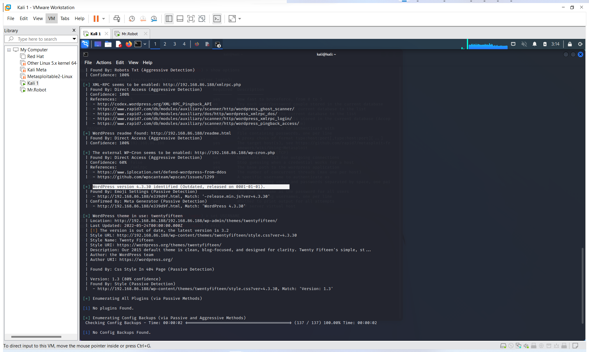
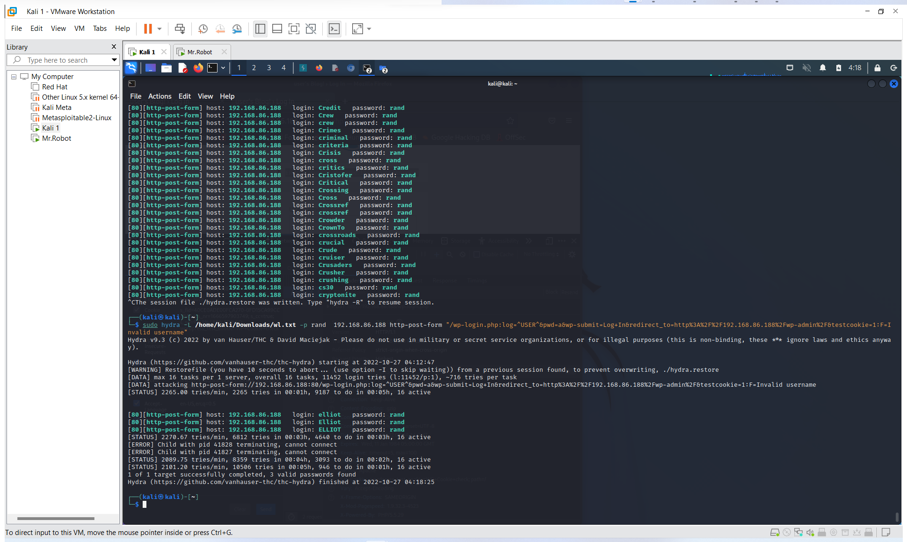
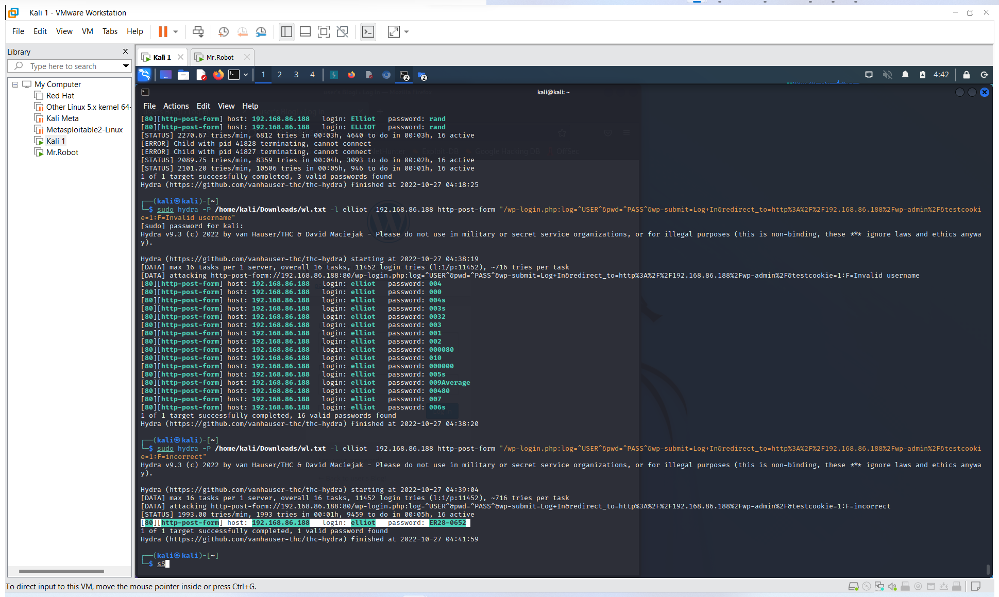

<h1>
IST4910: Mr.Robot
</h1>
<h3>Running an Nmap scan on Mr.Robot ip address</h3>

    
    <ul>
        <li>Running Linux 3.10-4.11</li> 
        <li>Port 22  (SSH   : Closed)</li>
        <li>Port 80  (HTTP  : Open)</li>
            <ul>
                <li>Uses Apache</li>
            </ul>
        <li>Port 443 (HTTPS : Open)</li>
            <ul>
                <li>SSL cert is valid</li>
                    <ul>
                        <li>Expires: 2025-09-13T10:45:03</li>
                    </ul>
            </ul>
    </ul>

<h3>Dirb to find hidden directories</h3>

<h3>WP Scan</h3>

    
<ul>
    <li>Wordpress Version 4.3.30</li>
</ul>

<h2>Hydra</h2>

<em><i>Initially I was using Burp Suite to bruteforce, but they throttle requests 
    with free version, so I found hydra as an alternative. I used this link to help
    me with using hydra 
    <a href="https://infinitelogins.com/2020/02/22/how-to-brute-force-websites-using-hydra/">Click here for Hydra Help!</a>
</i></em>

<h3>Username Bruteforce</h3>

Using the wordlist found in robots directory I bruteforced the username
    
<ul>
    <li>Valid Usernames</li>
        <ul>
            <li>elliot</li>
            <li>Elliot</li>
            <li>ELLIOT</li>
        </ul>
</ul>

<h2>Password Bruteforce</h2>

Using the wordlist found in robots directory I bruteforced the password
    
<ul>
    <li>Valid Password</li>
        <ul>
            <li>ER28-0652</li>
        </ul>
</ul>

<h1>KEYS</h1>
<h3>Key 1</h3>
    
Using dirb I started to look into the directories and found 
        that robots.txt had the first key
    

<h3>Key 2</h3>

<em><i>After some gooling i found an exploit on Metasploit which could 
    open a shell via wordpress, which I did. After looking through directories I found key 2
</i></em>

    

<h3>Key 3</h3>
    
<em><i> After googling I found an nmap vulnerability letting me be root, from 
        there I went
        to the same directory as before and found the last password
    </i></em>

        
    

